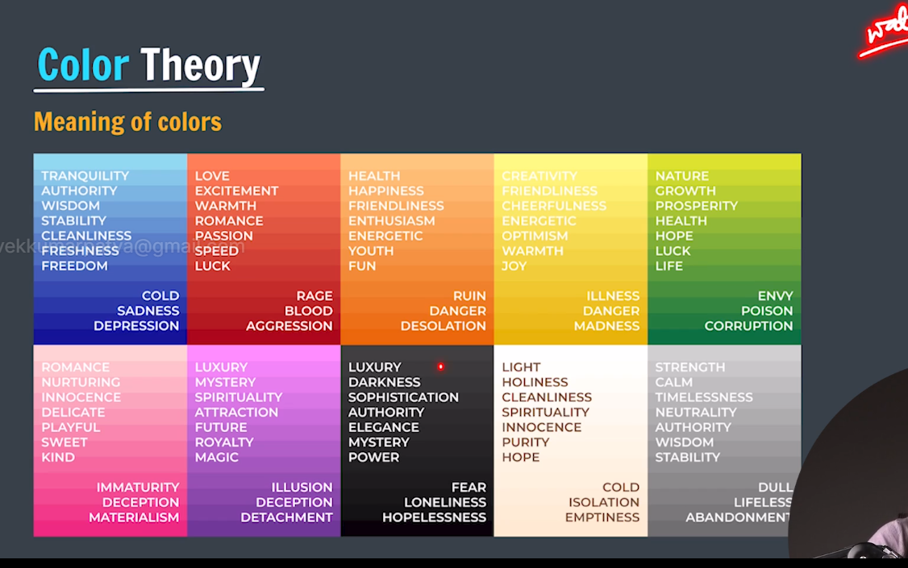

color theory == >

1 for subtle combination use = > monochromic
2 for impactful color combination use => complementry color
3 for High Contrast combination = > Triadic

canva color wheel for choose color .

Typography ==> style and Appearance of text

font families = sans serif, serif, monospace, cursive, fantasy

 2. ek section me maximum 2 font hone chahiye 

Icons ==>

fontaowsome, google icons 